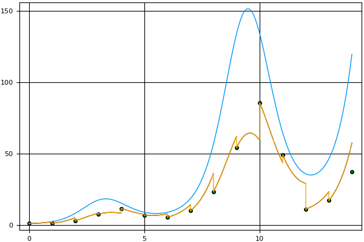
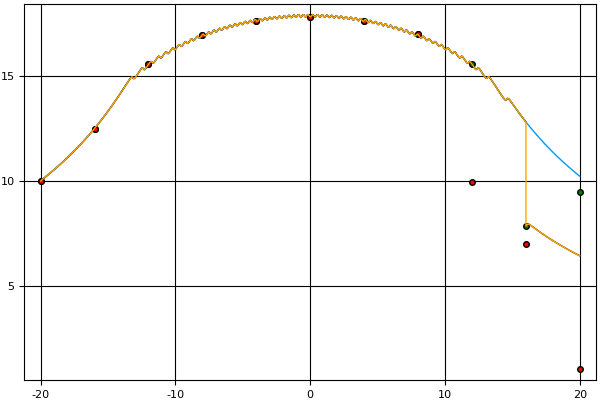

PARAREAL ALGORITHM IMPLEMENTATION AND SIMULATION IN JULIA {.titleHead}
---------------------------------------------------------

Tyler M. Masthay and Saverio Perugini\
 Department of Computer Science\
 University of Dayton\
 300 College Park\
 Dayton, Ohio  45469–2160\
 (937) 229–4079\
 {tmasthay1,saverio}@udayton.edu

\

ABSTRACT

We present a full implementation of the parareal algorithm—an
integration technique to solve differential equations in parallel—in the
Julia programming language for a fully general, first-order,
initial-value problem. We provide a brief overview of Julia—a concurrent
programming language for scientific computing. Our implementation of the
parareal algorithm accepts both coarse and fine integrators as functional
arguments. We use Euler’s method and another Runge-Kutta integration
technique as the integrators in our experiments. We also present a
simulation of the algorithm for purposes of pedagogy and as a tool for
investigating the performance of the algorithm.

### INTRODUCTION {.likesectionHead}

The parareal algorithm was first proposed in 2001 by Lions, Maday, and
Turinici [[7](#XLionsEtAl)] as an integration technique to solve
differential equations in parallel. We present a full implementation of
the parareal algorithm in the Julia programming language
(<https://julialang.org>) [[8](#XJulia)] for a fully general,
first-order, initial-value problem. Furthermore, we present a simulation
of the algorithm for purposes of pedagogy and as a tool for
investigating the performance of the algorithm. Our implementation
accepts both coarse and fine integrators as functional arguments. We use
Euler’s method and another Runge-Kutta integration technique as the
integrators in our experiments. We start with a brief introduction to
the Julia proramming language.

### AN INTRODUCTION TO JULIA: DYNAMIC, YET EFFICIENT SCIENTIFIC/NUMERICAL PROGRAMMING {.likesectionHead}

Julia is a multi-paradigm language designed for scientific computing
which supports multidimensional arrays, concurrency, and
metaprogramming. Due to both Julia’s LLVM-based Just-In-Time (JIT)
compiler and the language design, Julia programs run computationally
efficient—approaching and sometimes matching the speed of languages like
C. See [[1](#Xwebsite)] for a graph depicting the relative performance
of Julia compared to other common languages for scientific computing on a
set of micro-benchmarks.

#### Coroutines and CSP in Julia {.likesubsectionHead}

Coroutines are typically referred to as tasks in Julia, and are not
scheduled to run on separate CPU cores. Channels in Julia can be either
synchronous or asynchronous, and can be typed. However, if no type is
specified in the definition of the channel, then values of any types can
be written to that channel, much like unix pipes.

Messages are passed between coroutines through channels with the put!
and take!() functions. To add tasks to be automatically scheduled, use
the schedule() function, or the @schedule and @sync macros. Of course,
coroutines have little overhead, but will always run on the same cpu.

The current version of Julia multiplexes all tasks onto a single os
thread. Thus, while tasks involving i/o operations benefit from parallel
execution, compute bound tasks are effectively executed sequentially on a
single os thread. Future versions of Julia may support scheduling of
tasks on multiple threads, in which case compute bound tasks will enjoy
the benefits of parallel execution as
well [[2](#XJuliaParallelComputingMan)].

#### Parallel Computing {.likesubsectionHead}

In addition to tasks, Julia supports parallel computing—functions
running on distributed computers, or multiple cpus. New processes are
spawned with addproc(\<n\>), where \<n\> is the number of processes
desired. The function addproc returns the pids of the created processes.
The function workers returns a list of the processes. Alternatively, the
Julia interpreter can be started with the -p \<n\> option, where \<n\>
is the number of processes desired. For instance:

\$ julia \
julia\> addprocs(3) \
3−element Array{Int64,1}: \
 2 \
 3 \
 4 \
 \
julia\> workers() \
3−element Array{Int64,1}: \
 2 \
 3 \
 4 \
 \
ˆD \
\$ \
\$ julia −p 3 \
julia\> workers() \
3−element Array{Int64,1}: \
 2 \
 3 \
 4 \
 \
ˆD \
\$

Note that the process ids start at 2 because the Julia REPL shell is
process 1.

Processes in Julia which are either locally running or remotely
distributed, communicate with each other through message passing.

The function remotecall(\<Function\>, \<ProcessID\>, \<args …\>)
executes \<Function\> on worker \<ProcessID\> and returns a value of the
Future type, which contains a reference to a location from which the
return value can be retrieved, once \<Function\> has completed its
execution. The Future value can be extracted with the function fetch(),
which blocks until the result is available. Thus, the function
remotecall is used to send a message while the function fetch is used to
receive a message. For instance:

julia\> addprocs(2) \
julia\> future = remotecall(sqrt, 2, 4) \
Future(2,1,3,Nullable{Any}()) \
julia\> fetch(future) \
2.0

After the function remotecall is run, the worker process simply waits
for the next call to remotecall.

julia\> counter1 = new\_counter(3) \
(::\#1) (generic function with 1 method) \
julia\> future = remotecall(counter1, 2) \
Future(2,1,23,Nullable{Any}()) \
julia\> fetch(future) \
4

The Julia macro @spawn simplifies this message-passing protocol for the
programmer and obviates the need for explicit use of the low-level
remotecall function. Similarly, the macro @parallel can be used to run
each iteration of a (for) loop in its own process.

julia\> future = @spawn sqrt(4) \
julia\> fetch(future) \
2.0 \
julia\> addprocs(2) \
2−element Array{Int64,1}: \
 3 \
 4 \
julia\> @everywhere function fib(n) \
    if (n \< 2) \
        return n \
    else \
        return fib(n−1) + fib(n−2) \
    end \
end \
julia\> @everywhere function fib\_parallel(n) \
    if (n \< 35) \
        return fib(n) \
    else \
        x = @spawn fib\_parallel(n−1) \
        y = fib\_parallel(n−2) \
        return fetch(x) + y \
    end \
end \
julia\> @time fib(42) \
  2.271563 seconds (793 allocations: 40.718 KB) \
267914296 \
julia\> @time fib\_parallel(42) \
  3.483601 seconds (344.48 k allocations: \
                    15.344 MB, 0.25% gc time)

There are also remote channels which are writable for more control over
synchronizing processes.

It can accept a user-defined function that performs the computation in
parallel [[5](#XPPPP:Julia)].

#### Multidimensional Arrays {.likesubsectionHead}

Julia supports multidimensional arrays, which are an important data
structure in scientific computing applications, with a simple syntax and
their efficient creation and interpretation over many
dimensions [[4](#XOperators:Julia)]. The function call
ArrayType(\<dimensions\>) creates an array, where the nth argument in
dimensions specifies the size of the nth dimension of the array.
Similarly, the programmer manipulates these arrays using function calls
that support infinite-dimensional arrays given only limitations on
computational time. In summary, Julia incorporates concepts and
mechanisms—particularly concurrency and multidimensional arrays—which
support efficient scientific computing.

### THE PARAREAL ALGORITHM {.likesectionHead}

* * * * *

\

Figure 1: Right endpoint error.

* * * * *

The parareal algorithm is designed to perform parallel-in-time
integration for a first-order initial-value problem. The algorithm
involves two integration techniques, often known as the ‘coarse’
integrator and the ‘fine’ integrator. For the algorithm to be effective,
the coarse integrator must be of substantially lower computational cost
than the fine integrator. The reason will become apparent later in this
section. Consider the differential equation (1) given by

  ------------------------------------ ------------------------------------
  y′(t) = f(t,y(t))t ∈ [a,b]
  (1)
  ------------------------------------ ------------------------------------

with its associated initial-value problem (2)

  ------------------------------------ ------------------------------------
  y(t∗) = y∗t∗ ∈ [a,b].
  (2)
  ------------------------------------ ------------------------------------

For simplicity, let us assume t∗ = a, so that the solution only extends
rightward. To obtain an approximate solution to equation (1) satisfying
the initial condition (2), we partition our domain into [t0 = a,...,tN =
b] with uniform step size Δ. We now precisely define an ‘integrator’ as a
function from (0,∞) × ℝ2 ×ℛ to ℝ where ℛ is the set of all Riemann
integrable functions. For example, the integrator I given by

  -------------------------------
  I(δ,x0,y0,g) = y0 + g(x0,y0)δ
  -------------------------------

is the integrator corresponding to Euler’s method with step size δ. Let
𝒞 and ℱ be the coarse and fine integrators, respectively. Define

y0,1 = y(t0) = y∗ yn+1,1 = y(tn+1) = 𝒞(Δ,tn,yn,1,f).

Since yn+1,1 depends on yn,1, this algorithm is inherently sequential.
Partition [tn,tn+1] into {tn0 = t n,...,tnm,...t nM = t n+1} with
uniform step size δ \< Δ. Define

zn,10 = y(t n0) = y n,1 zn,1m+1 = y(t nm+1) = ℱ(δ,t nm,z n,1m,f).

This yields an approximate solution {zn,10,...,z n,1M} to (1) over
[tn,tn+1] with initial conditions

y(tn) = yn,1.

Since zn1,1m1 does not depend on zn2,1m2 for n1≠n2, we can compute these
approximations in parallel. After the last subproblem is solved, we
simply combine the solutions on each subdomain to obtain a solution over
the whole interval. However, our values {y1,1,...,yn,1} are relatively
inaccurate. The vertical spikes in the orange graph separating the
coarse and fine predictions in Figure [1](#x1-60011) illustrate this
error. However, zn−1,1M is a better approximation for ϕ(tn) where ϕ is
the exact solution to the differential equation. We use this to obtain a
better set of points {yn,2} for the coarse approximation. We do this by
first defining wn,1 = yn,1 and then defining

w1,2 = y1,1 = y1,2 = y∗ wn,2 = 𝒞(Δ,tn−1,yn−1,2,f) yn,2 = (wn,2 − wn,1) +
zn−1,1M.

Thus, wn+1,2 serves as a new prediction given a more accurate previous
prediction from yn,2 since zn−1,1M has now been taken into account in
calculating yn,2. In general, we continue evaluating so that for k \> 1,
we have

w1,k = y1,k = y∗ wn,k = 𝒞(Δ,tn−1,yn−1,k−1,f) yn,k = (wn,k − wn,k−1) +
zn−1,k−1M.

Note that since yn,k is dependent on wn,k, this step must be done
sequentially. As k increases, wn,k − wn,k−1 → 0, which means that yn,k
converges to the value that the fine integrator would predict if fine
integration were simply done sequentially. Thus, each k denotes fine
integration over the whole interval. This means that the total
computation performed is much greater than if fine integration were
performed sequentially. However, the time efficiency of each iteration has
the potential to be improved through concurrency. Since fine integration
is more computationally intensive, this improvement in the run-time
efficiency may compensate for the cumulative computation performed.

Let K be the total number of iterations necessary to achieve a desired
accuracy of solution and P be the number of subintervals into which we
divide according to the coarse integrator. If K = 1, then we achieve
perfect parallel efficiency. If K = P, then we likely slowed the
computation down. The parareal algorithm is guaranteed to converge to
the solution given by the sequential fine integrator within P iterations.
For a more complete treatment of this convergence analysis, we refer the
reader to [[6](#XGander)]. For fully general pseudocode, we refer the
reader to [[3](#XAubanel), [9](#XNielsen)].

### PARAREAL ALGORITHM IMPLEMENTATION IN JULIA {.likesectionHead}

* * * * *

Listing 1: Implementation of the parareal algorithm in Julia.

@everywhere function parareal(a,b,nC,nF,K,y0,f,coarseIntegrator,fineIntegrator) \
\#initialize coarse information \
xC = linspace(a,b,nC+1); \
yC = zeros(size(xC,1),K); \
deltaC = (b−a) / (nC + 1); \
yC[1,:] = y0; \
 \
\#”coarse integrator partially evaluated” \
ciPEvaled = ((x1,y1) −\> coarseIntegrator(deltaC,x1,y1,f)); \
 \
\#get initial coarse integration solution \
for i=2:(nC+1) \
   yC[i,1] = ciPEvaled(xC[i−1],yC[i−1,1]); \
end \
correctC = copy(yC); \
 \
\#initialize fine information \
xF = zeros(nC,nF+1); \
for i=1:nC \
   xF[i,:] = linspace(xC[i],xC[i+1],nF+1); \
end \
sub = zeros(nC,nF+1,K); \
deltaF = xF[1,2] − xF[1,1]; \
 \
\#”fine integrator partially evaluated” \
fiPEvaled = ((x1,y1) −\> fineIntegrator(deltaF,x1,y1,f)); \
 \
for k=2:K \
   \#run fine integration on each subdomain \
   tic(); \
   @sync for i=1:nC \
      sub[i,1,k] = correctC[i,k−1]; \
      @async for j=2:(nF+1) \
         sub[i,j,k] = fiPEvaled(xF[i,j−1],sub[i,j−1,k]); \
      end \
   end \
   toc(); \
 \
   \#predict and correct \
   for i=1:nC \
      yC[i+1,k] = ciPEvaled(xC[i],correctC[i,k]); \
      correctC[i+1,k] = yC[i+1,k] − yC[i+1,k−1] + sub[i,nF+1,k]; \
   end \
end \
 \
yF = zeros(nC∗(nF+1),K−1); \
for k=2:K \
   yF[:,k−1] = reshape(sub[:,:,k]’,nC∗(nF+1)); \
end \
 \
return reshape(xF’,nC∗(nF+1)),reshape(sub[:,:,K]’,nC∗(nF+1)),yF,sub,xC,correctC,yC; \
end

* * * * *

Listing [1](#x1-7001r1) presents an implementation of the parareal
algorithm (from the prior section) in Julia. The @async macro within the
loop causes the program to evaluate the first expression to its right as
a concurrent task (i.e., the for loop assigning values to sub). The
@sync macro causes the main program thread to wait until all tasks
(spawned in the the first expression to its right with an @async or
@parallel macro) complete. Once all concurrent tasks are complete,
execution of the program proceeds sequentially. Given the semantics of
these macros, the program in Listing [1](#x1-7001r1) correctly perform
concurrent integration. The sequential and parallel versions of this
implementation have no significant differences in run-time efficiency.
However, if a sleep statement is placed in the argument of
fineIntegrator, the parallel version runs much faster. This demonstrates
that use of those two macros does lead to concurrent program execution.

### GRAPHICAL ALGORITHM SIMULATION {.likesectionHead}

* * * * *

Listing 2: Implementation of a graphical simulator of the parareal
algorithm in Julia.

@everywhere function fullMethod(n,a,b,y0,f,integrator) \
   \#setup domain and range space \
    x = linspace(a,b,n+1); \
   deltaX = x[2] − x[1]; \
    y = ones(n+1,1); \
 \
   \#initialize left endpoint \
    y[1] = y0; \
 \
   \#integrate each point \
    for i=1:n \
        y[i+1] = integrator(deltaX,x[i],y[i],f); \
    end \
   return x,y; \
end \
 \
function simulate(a,b,N,M,K,y0,f,coarseInt,fineInt,showPrev) \
   x1,y1 = fullMethod(N∗(M+1),a,b,y0,f,fineInt); \
   x,y,yF,sub,xC,yC,iC = parareal(a,b,N,M,K,y0,f,coarseInt,fineInt); \
   xF = (reshape(x,M+1,N))’; \
   fine = M+1; \
   for k=2:K \
      display(plot(x1,y1)); \
      if(showPrev && k \> 2 ) \
         display(scatter!(xC,yC[:,k−2],color=”red”,legend=false)); \
      end \
      display(scatter!(xC,yC[:,k−1],color=”green”,legend=false)); \
      done = zeros(Int64,N,1); \
      workingSubdomains = 1:N; \
      while(done != (M+1) ∗ ones(N,1) ) \
         index = Int64(ceil(size(workingSubdomains,1)∗rand())); \
         currThread = workingSubdomains[index]; \
         while( done[currThread] == M+1 ) \
            currThread = Int64(ceil(N ∗ rand())); \
         end \
         currThreadPlot = Int64(ceil(fine∗rand())); \
         totalAdvance = done[currThread] + currThreadPlot; \
         if(totalAdvance \> fine) totalAdvance = fine; end \
         newP = (done[currThread]+1):totalAdvance; \
         display(plot!(xF[currThread,newP],sub[currThread,newP,k],color=”black”)); \
         done[currThread] = totalAdvance; \
         workingSubdomains = find( ((x)−\>x != M+1), done ); \
         print(join([”Working on subdomain \#”, currThread, ”...”, \
            ”Pending Subdomains: ”, workingSubdomains’, ”∖n”])); \
      end \
      display(plot!(x,yF[:,k−1],color=”orange”)); \
      sleep(5); \
   end \
end \
 \
\# Implementation schemes. \
function euler(delta,x0,y0,f) \
   return y0 + delta ∗ f(x0,y0); \
end \
 \
function rungeKutta(delta,x0,y0,f) \
   k1 = f(x0,y0); \
   k2 = f(x0+delta/2,y0 + (delta/2)∗k1); \
   k3 = f(x0+delta/2,y0 + (delta/2)∗k2); \
   k4 = f(x0+delta,y0+delta∗k3); \
   return y0 + (delta/6)∗(k1+2∗k2+2∗k3+k4); \
end

* * * * *

* * * * *

  ------------------
  
  
  ------------------

\

Figure 2: Slow parareal example. (left) Solution after first iteration
with Euler’s method. (right) Solution after ninth iteration with Euler’s
method.

* * * * *

The function simulate in Listing [2](#x1-8001r2) creates a graphical
simulator of the parareal algorithm. This function can be used to
introduce the parareal algorithm to students in a numerical analysis
course. The first line gets the sequential solution from the fine
integrator (the ‘ideal’ solution) and the second line gets the history
of the computations that took place during the parareal execution. The
main loop over the variable k then displays the inner workings of the
algorithm. The ideal solution is plotted, with a scatter plot of the
points obtained from the coarse integrator. To simulate the parallel
nature of the algorithm, random progress is made on randomly selected
subdomains. Thus, the plot dynamically makes partial progress on
different subdomains until all subdomains are finished with the fine
integration. After this, the plots are connected into the current
iteration’s approximation. During the next iteration, the previous
guesses from the coarse integrator are displayed in red and the new
guesses from the coarse integrator are displayed in green. As k
increases, these guesses converge to the ideal solution.

In addition to the use of this function for pedagogical purposes, it can
be used to investigate the types of curves for which the parareal
algorithm might be practical. For instance, consider the differential
equation

  -------------------------------
  y′(x) = sin(xy),x ∈ [−20, 20]
  -------------------------------

with y(−20) = 10, Δ = 4 (10 points), and δ = 0.008 (500 points).
Figure [2](#x1-80652) shows the first and ninth iterations. The ninth
iteration’s large error on the right end of the interval shows that this
is an example where parareal convergence is slow. This is as inefficient
as possible, needing as many iterations as subdomains in order for the
solution to converge. However, the simulation also shows that if f(x,y)
= sin(x)ex, then the solution converges after just one iteration. These
two examples show that the algorithm’s efficiency can be highly dependent
on the integrand. Below the simulation function are Euler’s method and
another Runge-Kutta integration technique that can be used as examples
to be passed as first-class functions as coarse or fine integration
techniques to the parareal or simulate functions. A Git repository of
both the implementation and graphical simulation is available in GitHub
at
<https://github.com/sperugin/Parareal-Implementation-and-Simulation-in-Julia.git>.
All of the graphical plots are generated with the Julia Plots package
available at <https://juliaplots.github.io/>. A video describing this
application of Julia is available on YouTube at
<https://www.youtube.com/watch?v=MtgbeLO6ZM4>.

### REFERENCES {.likesectionHead}

[1]   High performance JIT compiler. Available: <http://julialang.org>
[Last accessed: 24 April 2017].

[2]   Julia documentation: Parallel computing. Available:
[https://docs.julialang.org/en/stable/manual/parallel-computing/\\\#Parallel-Computing-1](https://docs.julialang.org/en/stable/manual/parallel-computing/\#Parallel-Computing-1)
[Last accessed: 22 May 2018].

[3]   Aubanel, E. Scheduling of tasks in the parareal algorithm.
Parallel Computing, 37(3):172–182, 2011.

[4]   Bezanson, J., Chen, J., Karpinski, S., Shah, V., and Edelman, A.
Array operators using multiple dispatch: A design methodology for array
implementations in dynamic languages. In Proceedings of ACM SIGPLAN
International Workshop on Libraries, Languages, and Compilers for Array
Programming, pages 56–61, New York, NY, 2014. ACM Press.

[5]   Chen, J. and Edelman, A. Parallel prefix polymorphism permits
parallelization, presentation and proof. In Proceedings of the First
Workshop for High Performance Technical Computing in Dynamic Languages
(HPTCDL), pages 47–56, Piscataway, NJ, USA, 2014. IEEE Press.

[6]   Gander, M. and Vandewalle, S. Analysis of the parareal
time-parallel time-integration method. SIAM Journal on Scientific
Computing, 29(2):556–578, 2007.

[7]   Lions, J.-L., Maday, Y., and Turinici, G. A “parareal” in time
discretization of pde’s. Comptes Rendus de l’Académie des Sciences -
Series I - Mathematics, 332:661–668, 2001.

[8]   Moffit, J. and Tate, B. Julia. In Tate, B., Daoud, F., Dees, I., and
Moffit, J., editors, Seven more languages in seven weeks: Languages that
are shaping the future, chapter 5, pages 171–207. Pragmatic Bookshelf,
Dallas, TX, 2014.

[9]   Nielsen, A. Feasibility study of the parareal algorithm. Master’s
thesis, Technical University of Denmark, 2012.

