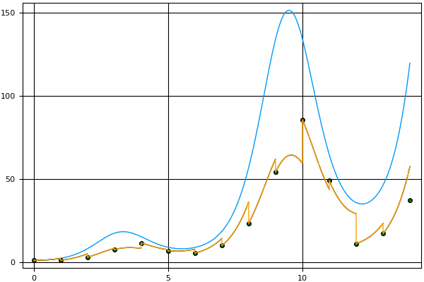
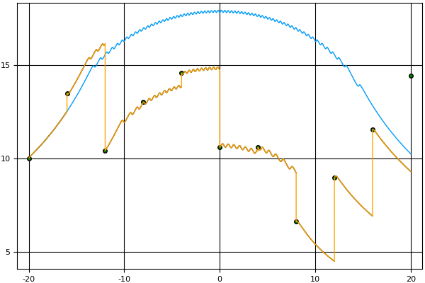
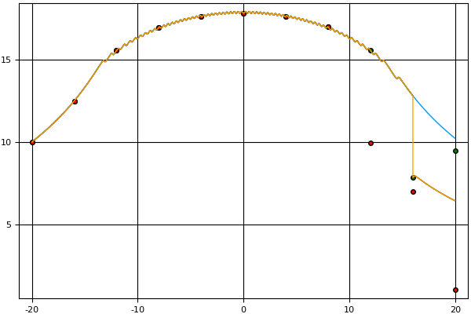

# Summary

We present an implementation of the parareal algorithm—an integration technique
to solve differential equations in parallel—first proposed in 2001 by Lions,
Maday, and Turinici [@Lions:2001]—in the Julia programming language
[@Julia:2014] for a fully general, first-order, initial-value problem.  We also
provide a graphical simulation of the parareal algorithm intended to be used in
a numerical analysis course to both introduce the parareal algorithm to
students and aid them in an investigation of the types of curves for which the
parareal algorithm might be practical.  Our implementation of the parareal
algorithm accepts both coarse and fine integrators as functional arguments.  We
provide implementations of Euler’s method and another Runge-Kutta integration
technique as the integrators.  The final two functions in the source code file
\texttt{parareal.jl} are functions implementing Euler’s method and another
Runge-Kutta integration technique that can be used as examples to be passed as
first-class functions as coarse or fine integration techniques to the
\texttt{parareal} or \texttt{simulate} functions.  A Git repository of both the
implementation and graphical simulation is available in GitHub at
<https://github.com/sperugin/Parareal-Implementation-and-Simulation-in-Julia.git>.
All of the graphical plots are generated with the Julia Plots package available
at <https://juliaplots.github.io/>.  A video describing this application of
Julia is available on YouTube at <https://www.youtube.com/watch?v=MtgbeLO6ZM4>.
The purpose of this software is pedagogical: as a simulation to introduce
students to the parareal algorithm and the concept of concurrency, and as a
tool for (graphically) investigating the performance of the algorithm.

# The Parareal Algorithm

* * * * *

\

Figure 1: Right endpoint error.

* * * * *

The parareal algorithm is designed to perform parallel-in-time
integration for a first-order initial-value problem. The algorithm
involves two integration techniques, often known as the ‘coarse’
integrator and the ‘fine’ integrator. For the algorithm to be effective,
the coarse integrator must be of substantially lower computational cost
than the fine integrator. The reason will become apparent later in this
section. Consider the differential equation (1) given by

  ------------------------------------ ------------------------------------
  y′(t) = f(t,y(t))t ∈ [a,b]
  (1)
  ------------------------------------ ------------------------------------

with its associated initial-value problem (2)

  ------------------------------------ ------------------------------------
  y(t∗) = y∗t∗ ∈ [a,b].
  (2)
  ------------------------------------ ------------------------------------

For simplicity, let us assume t∗ = a, so that the solution only extends
rightward. To obtain an approximate solution to equation (1) satisfying
the initial condition (2), we partition our domain into [t0 = a,...,tN =
b] with uniform step size Δ. We now precisely define an ‘integrator’ as a
function from (0,∞) × ℝ2 ×ℛ to ℝ where ℛ is the set of all Riemann
integrable functions. For example, the integrator I given by

  -------------------------------
  I(δ,x0,y0,g) = y0 + g(x0,y0)δ
  -------------------------------

is the integrator corresponding to Euler’s method with step size δ. Let
𝒞 and ℱ be the coarse and fine integrators, respectively. Define

y0,1 = y(t0) = y∗ yn+1,1 = y(tn+1) = 𝒞(Δ,tn,yn,1,f).

Since yn+1,1 depends on yn,1, this algorithm is inherently sequential.
Partition [tn,tn+1] into {tn0 = t n,...,tnm,...t nM = t n+1} with
uniform step size δ \< Δ. Define

zn,10 = y(t n0) = y n,1 zn,1m+1 = y(t nm+1) = ℱ(δ,t nm,z n,1m,f).

This yields an approximate solution {zn,10,...,z n,1M} to (1) over
[tn,tn+1] with initial conditions

y(tn) = yn,1.

Since zn1,1m1 does not depend on zn2,1m2 for n1≠n2, we can compute these
approximations in parallel. After the last subproblem is solved, we
simply combine the solutions on each subdomain to obtain a solution over
the whole interval. However, our values {y1,1,...,yn,1} are relatively
inaccurate. The vertical spikes in the orange graph separating the
coarse and fine predictions in Figure [1](#x1-60011) illustrate this
error. However, zn−1,1M is a better approximation for ϕ(tn) where ϕ is
the exact solution to the differential equation. We use this to obtain a
better set of points {yn,2} for the coarse approximation. We do this by
first defining wn,1 = yn,1 and then defining

w1,2 = y1,1 = y1,2 = y∗ wn,2 = 𝒞(Δ,tn−1,yn−1,2,f) yn,2 = (wn,2 − wn,1) +
zn−1,1M.

Thus, wn+1,2 serves as a new prediction given a more accurate previous
prediction from yn,2 since zn−1,1M has now been taken into account in
calculating yn,2. In general, we continue evaluating so that for k \> 1,
we have

w1,k = y1,k = y∗ wn,k = 𝒞(Δ,tn−1,yn−1,k−1,f) yn,k = (wn,k − wn,k−1) +
zn−1,k−1M.

Note that since yn,k is dependent on wn,k, this step must be done
sequentially. As k increases, wn,k − wn,k−1 → 0, which means that yn,k
converges to the value that the fine integrator would predict if fine
integration were simply done sequentially. Thus, each k denotes fine
integration over the whole interval. This means that the total
computation performed is much greater than if fine integration were
performed sequentially. However, the time efficiency of each iteration has
the potential to be improved through concurrency. Since fine integration
is more computationally intensive, this improvement in the run-time
efficiency may compensate for the cumulative computation performed.

Let $K$ be the total number of iterations necessary to achieve a desired
accuracy of solution and $P$ be the number of subintervals into which we divide
according to the coarse integrator. If $K = 1$, then we achieve perfect
parallel efficiency.  If $K = P$, then we likely slowed the computation down. The
parareal algorithm is guaranteed to converge to the solution given by the
sequential fine integrator within $P$ iterations.  For a more complete treatment
of this convergence analysis, we refer the reader to [@Gander:2007]. For fully
general pseudocode, we refer the reader to [@Aubanel:2011, @Nielsen:2012].

# Parareal Algorithm Implementation in Julia

The @async macro within the loop causes the program to evaluate the first
expression to its right as a concurrent task (i.e., the for loop assigning
values to sub). The @sync macro causes the main program thread to wait until
all tasks (spawned in the the first expression to its right with an @async or
@parallel macro) complete. Once all concurrent tasks are complete, execution of
the program proceeds sequentially. Given the semantics of these macros, the
program correctly perform concurrent integration. The sequential and parallel
versions of this implementation have no significant differences in run-time
efficiency.  However, if a sleep statement is placed in the argument of
fineIntegrator, the parallel version runs much faster. This demonstrates that
use of those two macros leads to concurrent program execution.

# Graphical Algorithm Simulation

  ------------------
  
  
  ------------------

\

Figure 2: Slow parareal example. (left) Solution after first iteration
with Euler’s method. (right) Solution after ninth iteration with Euler’s
method.

* * * * *

The function \texttt{simulate} creates a graphical simulator of the parareal algorithm
and can be used to introduce the parareal algorithm to students in a numerical
analysis course. The first line gets the sequential solution from the fine
integrator (the ‘ideal’ solution) and the second line gets the history of the
computations that took place during the parareal execution. The main loop over
the variable k then displays the inner workings of the algorithm. The ideal
solution is plotted, with a scatter plot of the points obtained from the coarse
integrator. To simulate the parallel nature of the algorithm, random progress
is made on randomly selected subdomains. Thus, the plot dynamically makes
partial progress on different subdomains until all subdomains are finished with
the fine integration. After this, the plots are connected into the current
iteration’s approximation. During the next iteration, the previous guesses from
the coarse integrator are displayed in red and the new guesses from the coarse
integrator are displayed in green. As k increases, these guesses converge to
the ideal solution.

In addition to the use of this function for pedagogical purposes, it can be
used to investigate the types of curves for which the parareal algorithm might
be practical. For instance, consider the differential equation

  -------------------------------
  y′(x) = sin(xy),x ∈ [−20, 20]
  -------------------------------

with y(−20) = 10, Δ = 4 (10 points), and δ = 0.008 (500 points).
Figure [2](#x1-80652) shows the first and ninth iterations. The ninth
iteration’s large error on the right end of the interval shows that this is an
example where parareal convergence is slow. This is as inefficient as possible,
needing as many iterations as subdomains in order for the solution to converge.
However, the simulation also shows that if f(x,y) = sin(x)ex, then the solution
converges after just one iteration. These two examples show that the
algorithm’s efficiency can be highly dependent on the integrand.

# References
